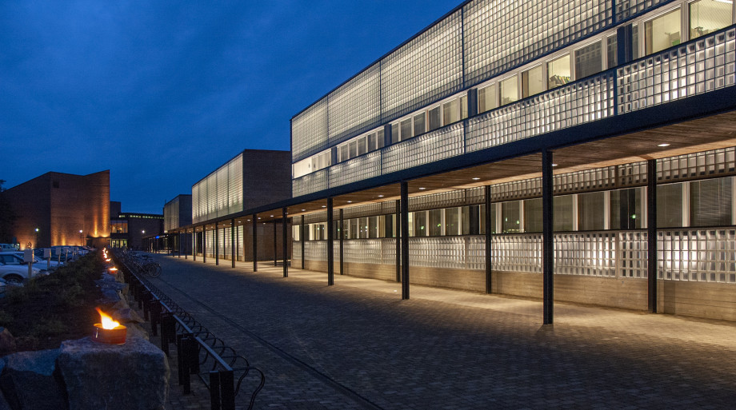
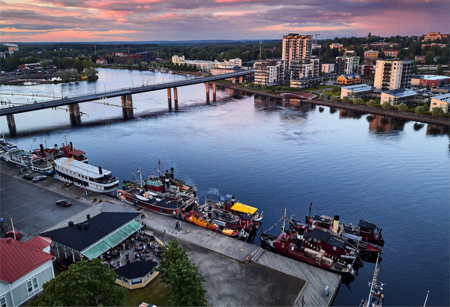

# cycleGan
simple cycleGan unpaired image to image model, final project for AI course 2025.

The goal is to translate real pictures to Monent style paintings and vice versa.

## example results after 20 epochs:
- picture -> painting
- painting -> picture 

## example of Joensuu campus and city pictures in painting:
- Joensuu campus

- Joensuu city

